#AWS Elastic Load Balancing with HP Vertica
Did you know that you can use an Elastic Load Balancer (ELB) to connect to your HP Vertica cluster running on Amazon Web Services? Here are several good reasons why you might want to try it:
- You won't need to allocate and manage public/elastic IP addresses for cluster nodes, since clients connect only to the ELB using one DNS Name.
- It automatically distributes incoming connections across all the cluster nodes.
- It is automatically highly available, so you don't need to worry about it failing.
- It scales automatically, so you don't need to worry about it becoming a bottleneck.
- It works seamlessly with our open source [Automatic Vertica Scaling and Node Replacement](https://community.dev.hp.com/t5/Vertica-Blog/Automatic-Vertica-Scaling-and-Node-Replacement-on-AWS/ba-p/230468) package, automatically detecting when nodes are added, removed or replaced.
- It will continually monitor the health of each cluster node by pinging the database port, and it will not route connections to any node that is down.
- You can monitor your database connections using AWS CloudWatch and/or ELB access log files.


If you already have an HP Vertica cluster running on AWS, it is easy to set up an Elastic Load Balancer to experiment. It's not intrusive - you don't have to change any aspect of your existing cluster.

Or you might want to use our open source [Automatic Vertica Scaling and Node Replacement](https://community.dev.hp.com/t5/Vertica-Blog/Automatic-Vertica-Scaling-and-Node-Replacement-on-AWS/ba-p/230468) package to create a new HP Vertica cluster using an auto scaling group. The Elastic Load Balancer is especially useful in combination with auto scaling, providing a single entry point to isolate clients from any node additions, removals, or replacements that occur behind the scenes.

Amazon's Elastic Load Balancing [documentation](http://docs.aws.amazon.com/ElasticLoadBalancing/latest/DeveloperGuide/elastic-load-balancing.html) is well worth reading if you decide to get serious about using ELB. In the meantime, here is a quick overview of how to quickly get going with an ELB for your Vertica cluster.

## Before you start

You need to have an HP Vertica database cluster up and running in an AWS VPC subnet. See the [HP Vertica on Amazon Web Services Guide](http://my.vertica.com/docs/Ecosystem/Amazon/HP_Vertica_7.1.x_Vertica_AWS.pdf), or use our open source [Automatic Vertica Scaling and Node Replacement](https://community.dev.hp.com/t5/Vertica-Blog/Automatic-Vertica-Scaling-and-Node-Replacement-on-AWS/ba-p/230468) package to get started.  

The new Elastic Load Balancer will sit on the same subnet as your HP Vertica nodes, and will be assigned IP Addresses from your subnet's CIDR. Per Amazon [documentation](http://docs.aws.amazon.com/ElasticLoadBalancing/latest/DeveloperGuide/setting-up-elb.html#set-up-ec2), you must have at least 8 free IP Addresses in the subnet for the ELB to use.

Validate that you can connect to any of the database nodes, using vsql or your database client of choice.

## Create an Elastic Load Balancer

From the AWS Console, open the [EC2 Dashboard](https://console.aws.amazon.com/ec2/). From the navigation bar, select the AWS Region where your HP Vertica cluster is running.  
Select **Load Balancers** on the left.  
Click the blue **Create Load balancer** button at the top of the page.

####Step 1: Define Load Balancer 

i) Name your new Load Balancer
ii) Associate it with the VPC and Subnet containing your HP Vertica cluster
iii) Configure protocol and port for HP Vertica client connections

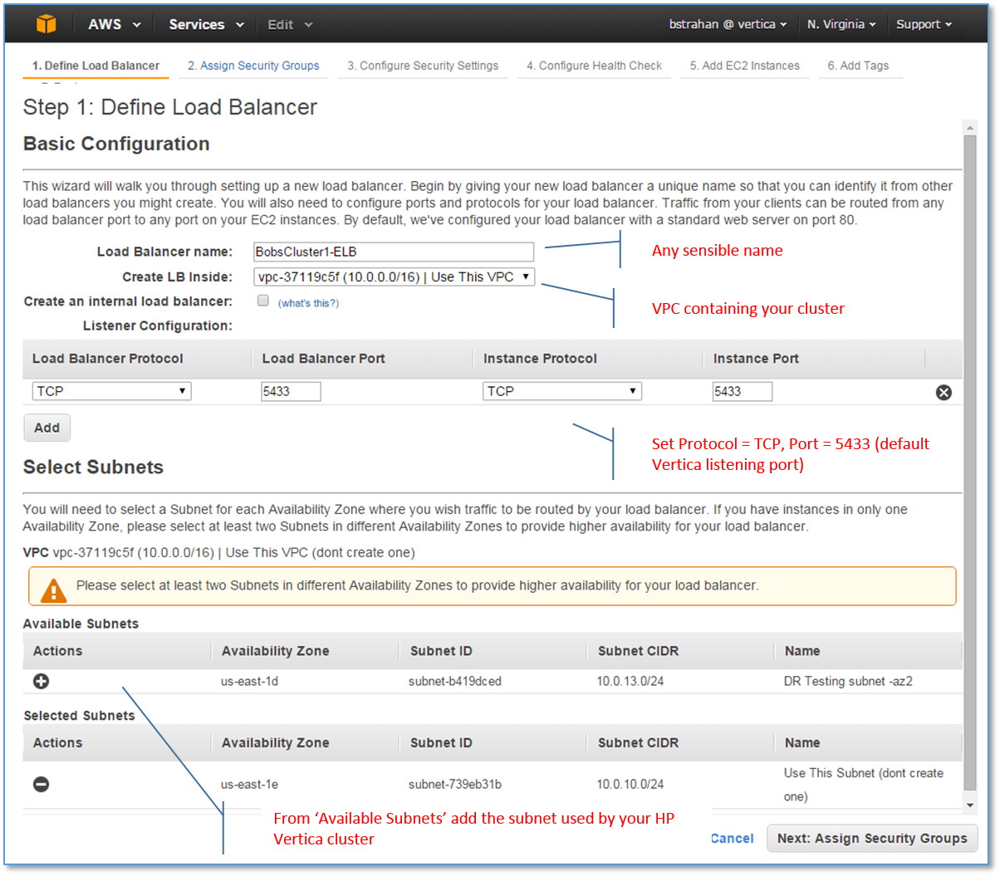

####Step 2: Assign Security Groups  

You can assign an existing security group, or create a new one. Be sure that the assigned security group does not block TCP traffic on the Vertica port (5433)!

Here we have elected to create a new security group which restricts the ELB to forward incoming database connections only.

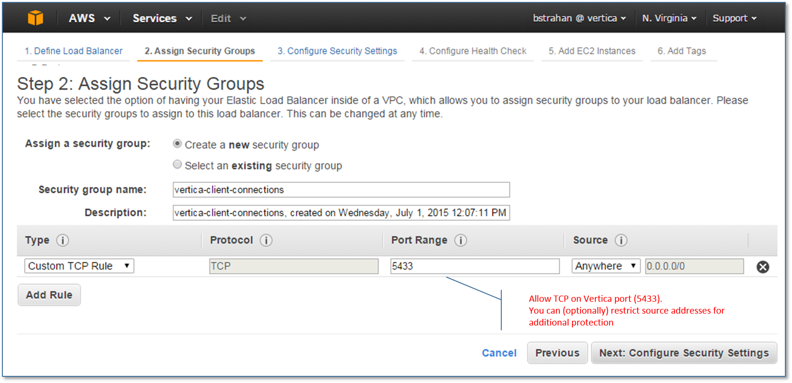

####Step 3: Configure Security Settings

Ignore the 'secure listener' warning.

It is theoretically possible to configure the ELB to handle SSL on behalf of the cluster nodes, but this has not been tested.
Instead, you should enable HP Vertica native support for secure connections over SSL - see [Implementing SSL](http://my.vertica.com/docs/7.1.x/HTML/index.htm#Authoring/AdministratorsGuide/Security/SSL/ImplementingSSL.htm%3FTocPath%3DAdministrator's%2520Guide%7CImplementing%2520Security%7CImplementing%2520SSL%7C_____0). HP Vertica SSL mode is transparent to the Elastic Load Balancer and does not impact any of the setup requirements.

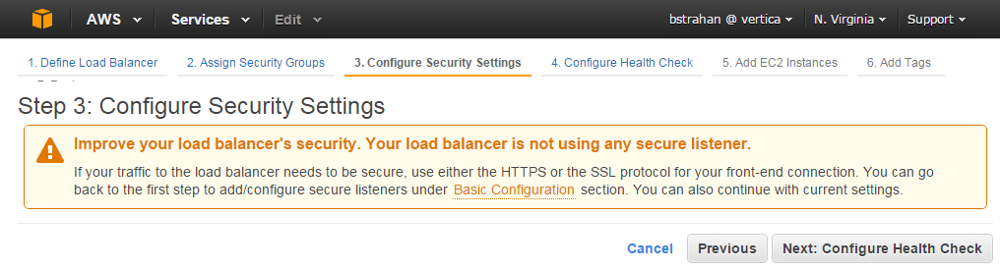

####Step 4: Configure Health Check  

The Health Check defaults will validate that each HP Vertica node is accepting connections on the database port every 30 second interval. The ELB will not route connections to unhealthy instances. For now, we'll accept the defaults as shown.

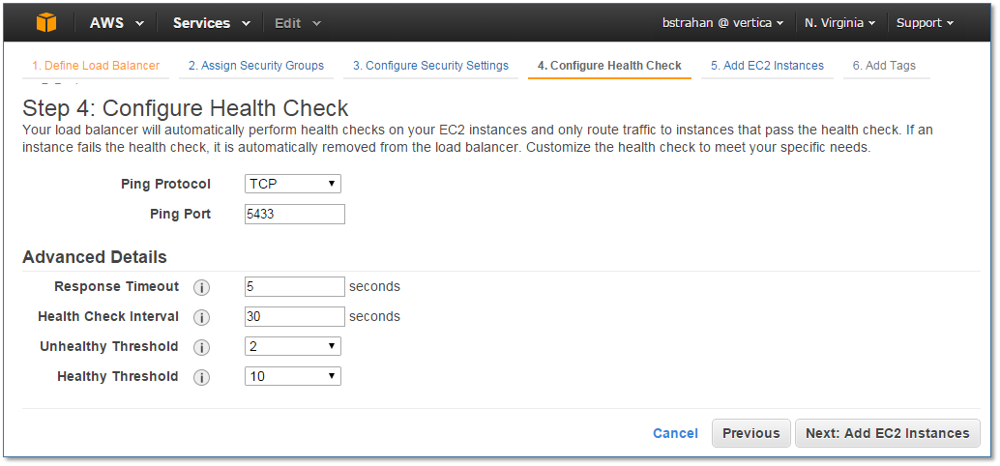

####Step 5: Add EC2 Instances  

If you are using the [Automatic Vertica Scaling and Node Replacement](https://community.dev.hp.com/t5/Vertica-Blog/Automatic-Vertica-Scaling-and-Node-Replacement-on-AWS/ba-p/230468) package, then do not assign instances. Instead, we will later associate our Elastic Load Balancer with the cluster auto scaling group, which will allow instances to be dynamically added and removed.

If you have created your own HP Vertica cluster on AWS (not using auto scaling), then use this step to select and assign all the EC2 instances serving as nodes in your cluster, from the list.

*You can also assign and remove instances later, using the **Instances** tab in the **Load Balancers** page of the [EC2 Dashboard](https://console.aws.amazon.com/ec2/).*

Deselect the checkbox **Cross-Zone Load Balancing** check box, because your Vertica cluster is most likely running inside a placement group (in a single availability zone subnet).

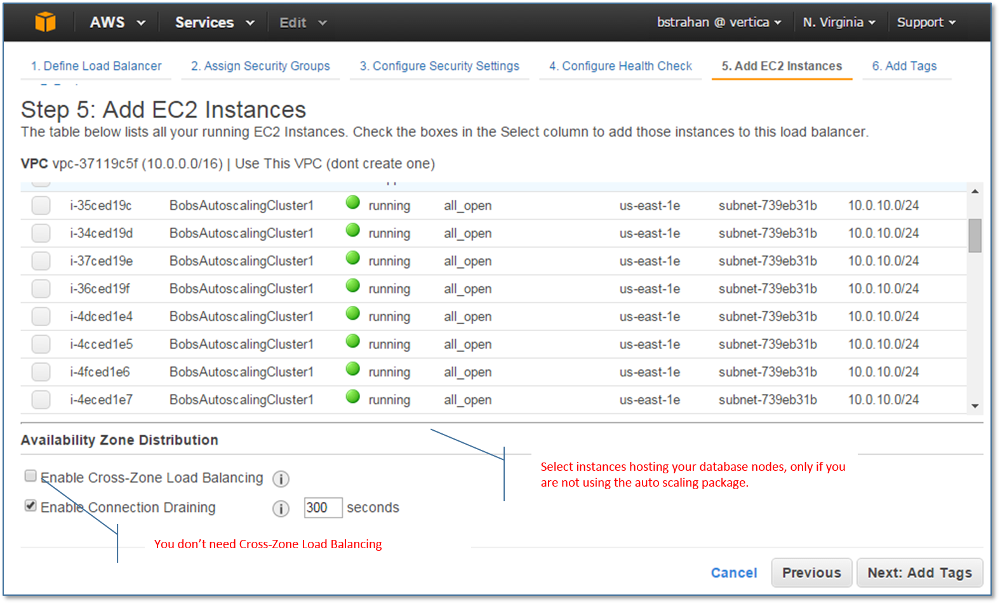


####Step 6: Add Tags

This step is optional - take it or leave it! Tags can be very handy though, for filtering dashboard views, billing reports, CLI results, and more.

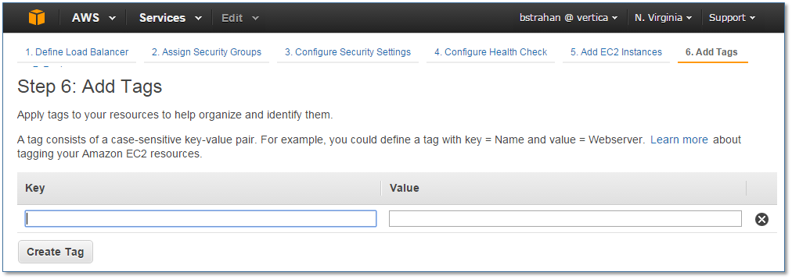

####Step 7: Review and Create

Double check the configuration, and click **Create** (bottom right) to initialize your new Elastic Load Balancer.

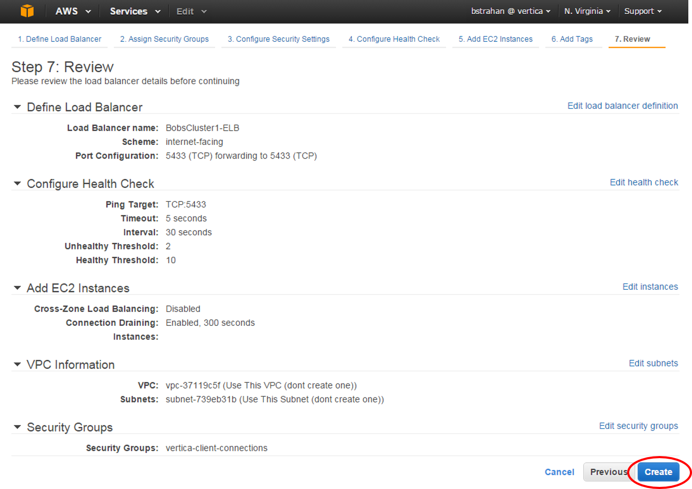

####Increase ELB connection idle timeout

By default, the Elastic Load Balancer will drop incoming connections if they are idle for 60 seconds.
To keep idle sessions alive for longer, change the connection settings **Idle Timeout** value. From the [EC2 Dashboard](https://console.aws.amazon.com/ec2/), select the **Load Balancers** page, and open the **Details** tab. Click the Connection Settings **Edit** link, and increase the value.

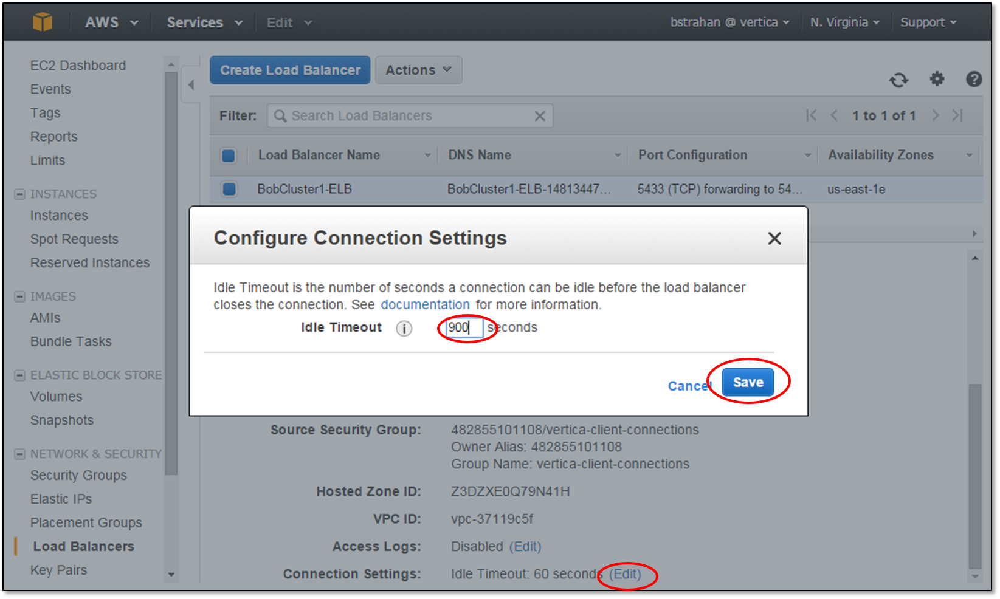

####(Optional) Enable Access Logs

If you want to log all the incoming connection requests, you can configure the Elastic Load Balancer to save access log files to an S3 location of your choice. From the [EC2 Dashboard](https://console.aws.amazon.com/ec2/), select the **Load Balancers** page, and open the **Details** tab. Click the Access Logs **Edit** link, and set up the frequency and location for your log files.

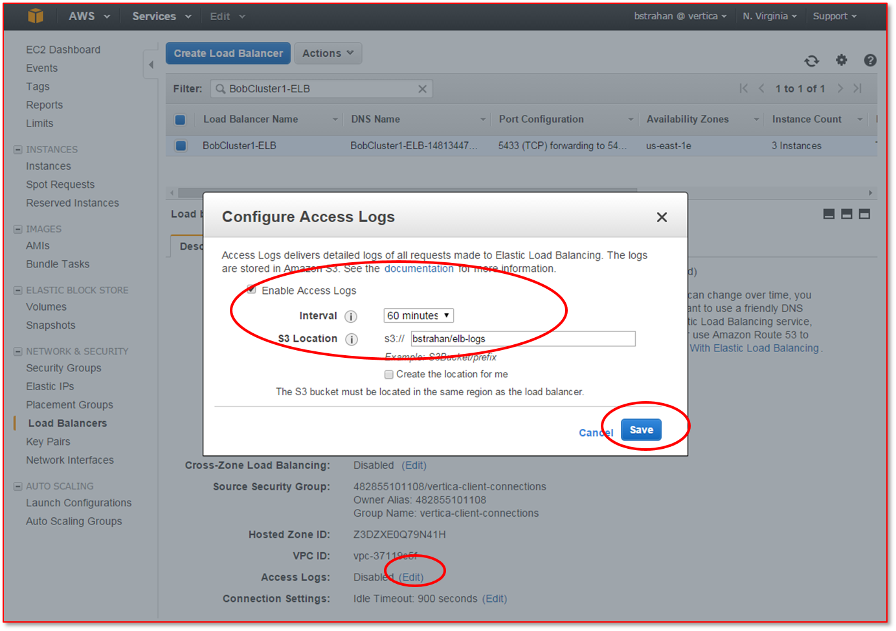

## Associate the Load Balancer with your Auto Scaling group

This section is relevant only if your cluster is managed by an AWS Auto Scaling group - see [Automatic Vertica Scaling and Node Replacement](https://community.dev.hp.com/t5/Vertica-Blog/Automatic-Vertica-Scaling-and-Node-Replacement-on-AWS/ba-p/230468)

From the [EC2 Dashboard](https://console.aws.amazon.com/ec2/), select **Auto Scaling Groups** on the left panel. Select the group for the cluster you want to assign the Elastic Load balancer to, and open the **Details** tab. Click the **Edit** button on the right of the tab.

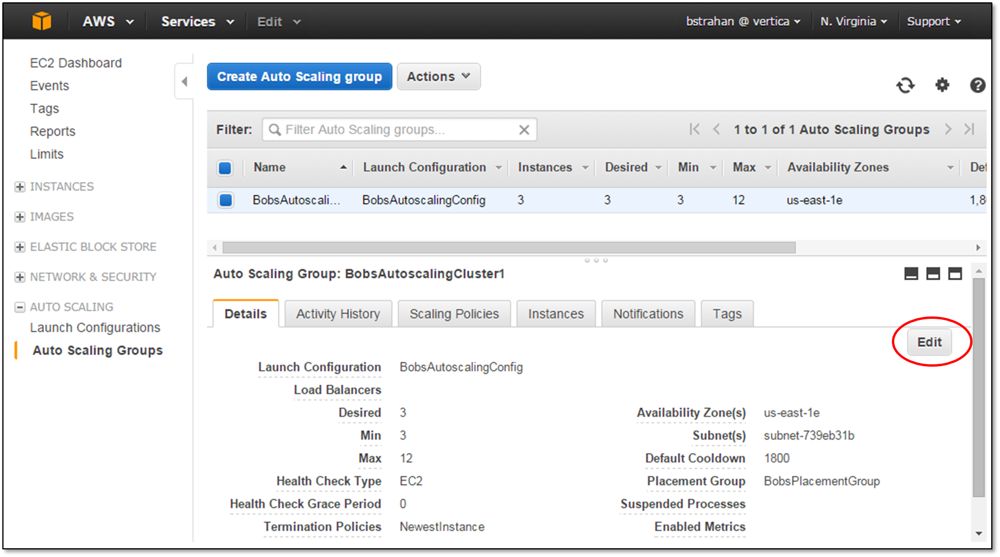

Add the new Elastic Load balancer instance, and click the **Save** button.

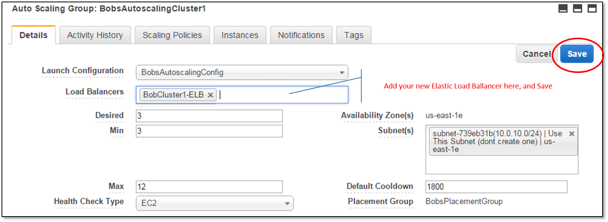

Go back to the Load Balancers page in the [EC2 Dashboard](https://console.aws.amazon.com/ec2/), select the **Instances** tab, and you should see that your cluster instances have been automatically added by the auto scaling group. As you use auto scaling to expand, contract, or replace failed nodes in your cluster, the Load Balancer configuration will be maintained automatically.


## Connect to the database using the Elastic Load Balancer

First you need to get the DNS Name for your Load Balancer. From the [EC2 Dashboard](https://console.aws.amazon.com/ec2/), select the **Load Balancers** page (on the left), and then open the **Details** tab. The automatically assigned DNS name is shown. This is the name you will use to identify the database host for all your client connections.

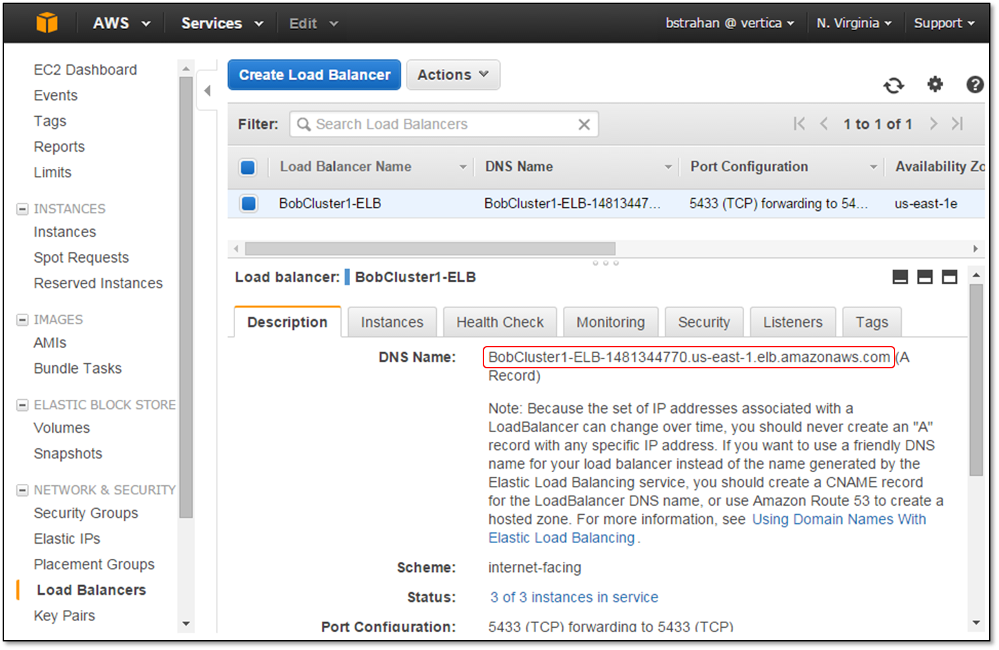

Use this DNS Name to configure your client connections, and validate that the Elastic Load Balancer is routing your connections to different nodes.

Here we can see that the first connection, from a remote vsql client, is routed to node0001.
```
C:\Users\BOSTR>vsql -h BobCluster1-ELB-1481344770.us-east-1.elb.amazonaws.com -U dbadmin -w N0tT3ll1ng
Welcome to vsql, the Vertica Analytic Database interactive terminal.

dbadmin=> select node_name from current_session ;
    node_name
------------------
 v_vmart_node0001
(1 row)

```
A second connection is routed to node0003.
```
C:\Users\BOSTR>vsql -h BobCluster1-ELB-1481344770.us-east-1.elb.amazonaws.com -U dbadmin -w N0tT3ll1ng
Welcome to vsql, the Vertica Analytic Database interactive terminal.

dbadmin=> select node_name from current_session ;
    node_name
------------------
 v_vmart_node0003
(1 row)
```

The Load Balancer is working!

## Monitoring

From the [EC2 Dashboard](https://console.aws.amazon.com/ec2/), select the **Load Balancers** page (on the left), and then open the **Monitoring** tab to see charts showing connection counts, health check results, and more. Use the **Create Alarm** button on the top right to configure your custom alerts (for example, you may want to receive an SNS notification when nodes fail a health check, or when the number of connection requests exceeds your expected threshold).

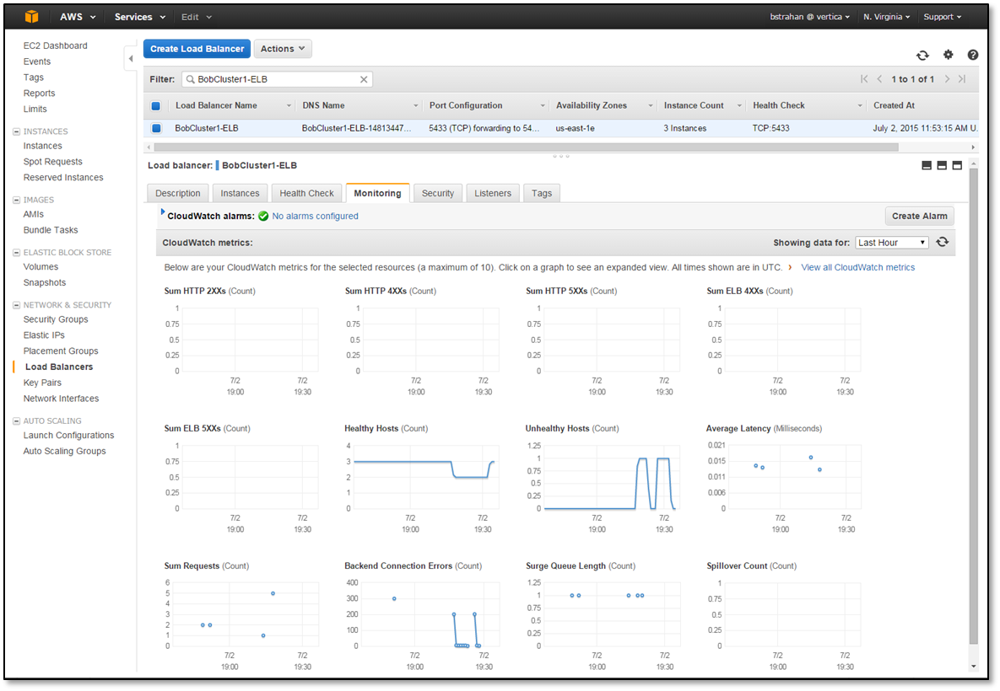

----

*The use of AWS Elastic Load Balancing is not a formally tested or supported HP Vertica configuraton. Nevetheless, we hope you feel encouraged to experiment. See what works, and post your feedback and best practices back to the community. Good luck!*
