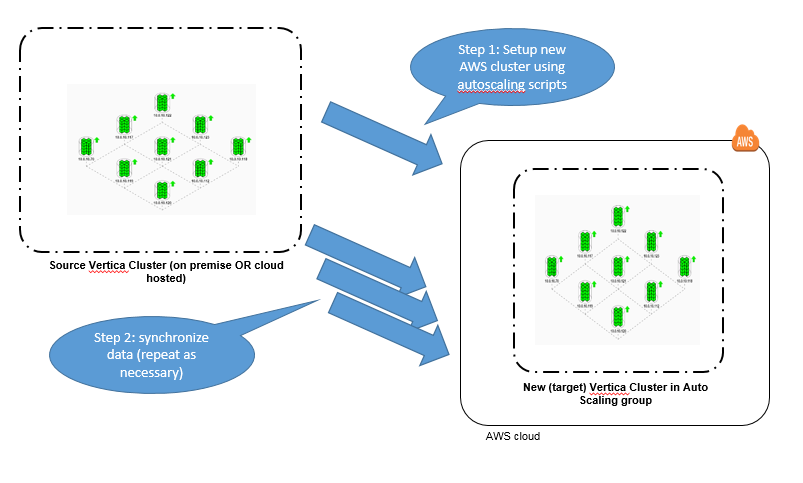

# Cloning an HP Vertica cluster to AWS

This enhancement to the [HP Vertica AWS Auto Scaling](https://community.dev.hp.com/t5/Vertica-Blog/Automatic-Vertica-Scaling-and-Node-Replacement-on-AWS/ba-p/230468) open-source package makes it quite easy to create a working replica of your existing cloud hosted or on-premise HP Vertica cluster.
 
You may want to clone your HP Vertica cluster to:
 
- **Create a Disaster Recovery Cluster**

  By replicating your database to a "cluster in the cloud", you can establish a working backup database that you can use if disaster strikes your primary cluster. Once your backup cluster has been established, you can periodically (and incrementally) re-synchronize it with the primary cluster to keep it up to date. 

  Save money by suspending the backup cluster when it is not in use, and resuming it again when needed. Use the `suspendCluster.sh` and `resumeCluster.sh` utilities provided with the HP Vertica AWS Auto Scaling open-source package. While the cluster is suspended, your AWS usage charges will be significantly reduced.


- **Create Sandbox Clusters**

  You can easily create on-demand sandbox environments for development and/or test by cloning your production database to the AWS cloud. You can create as many replica clusters as you need, and, when you are done, you can suspend or terminate them. 

  This is a great way to try out design and tuning changes before committing them to the production cluster. By leveraging the auto scaling features of your new replica cluster, you can also experiment with the effects of scaling the cluster size up and down.


- **Establish Regional Database Replicas**

  You may want to load balance your application workload across duplicate clusters in multiple AWS regions. You can use the new `copyCluster.sh` script to establish your regional replicas, and to periodically resynchronize them with your master database during scheduled maintenance windows.  


- **Migrate from your on-premise datacenter to the cloud**

  You can set up experimental copies of your on-premise database in the AWS cloud, see how they work, and when you are ready you can clone the most recent data before going live with your new AWS-hosted HP Vertica cluster.

- **Take advantage of Auto Scaling**

  Copy data from your existing on-premise or cloud based cluster to a new AWS Auto Scaling cluster, and take advantage of all the features offered by [Auto Scaling](https://community.dev.hp.com/t5/Vertica-Blog/Automatic-Vertica-Scaling-and-Node-Replacement-on-AWS/ba-p/230468) and [Elastic Load Balancing](https://github.com/vertica/aws-autoscaling-vertica/blob/master/AWS-ElasticLoadBalancer-for-Vertica.md).


## Task Overview

There are two main tasks involved:

1.	Create a new target cluster using the HP Vertica AWS Auto Scaling open source package installed on one of the nodes of your existing cluster. 

2.	Clone the database to the new target cluster. You can repeat this step periodically to incrementally resynchronize the clusters.
 



## Task 1: Create a Target Cluster

Install the [HP Vertica AWS Auto Scaling](https://community.dev.hp.com/t5/Vertica-Blog/Automatic-Vertica-Scaling-and-Node-Replacement-on-AWS/ba-p/230468) open source package on one of your existing cluster nodes. 

Set up the configuration file as instructed in the directions, to specify your credentials, region, subnet, license, etc. Choose EC2 instance types to provide sufficient CPU and memory resources for your projected workload on the target cluster, and sufficient disk space to hold your database.

Be sure to:  
1. set `autoscaling_group_name` variable to specify a *unique* name for your new cluster  
2. set `desired` cluster size to match the node count of your existing cluster  
3. set `database_name` and `password` to match your source database  
4. ensure your subnet Network ACLs (if applicable), and your VPC and EC2 instance security groups are all set up to allow the following protocols between your source cluster and the new target cluster:
  - ssh (TCP/22)  
  - vsql (TCP/5433)  
  - rsync (TCP/50000)  

Once you have the configuration file set up the way you want it, you can create your new cluster by running the following commands as described in the [README](https://github.com/vertica/aws-autoscaling-vertica/blob/master/README.md) file:
```
./setup_autoscaling.sh
./bootstrap.sh
./scale_cluster.sh
```

If you want to clone your cluster multiple times, then make multiple copies of the autoscale directory, once for each target cluster. Specify unique values for `autoscaling_group_name` in each copy of the configuration file, and create your clusters by repeating the above commands in each directory. 

Use `cluster_ip_addresses.sh` to check that the cluster scaleup has completed, and that your new cluster has the required number of nodes.

The new cluster has been automatically enabled with passwordless ssh access from your source cluster nodes, for the dbadmin user. This is not just a convenience, but a pre-requisite for the next task.

You are now ready to clone your local database to the new cluster.


## Task 2: Clone the Database

To clone your database, run the `copyCluster.sh` script from the autoscale directory where you configured the new target cluster. This script is now included with the [HP Vertica AWS Auto Scaling](https://community.dev.hp.com/t5/Vertica-Blog/Automatic-Vertica-Scaling-and-Node-Replacement-on-AWS/ba-p/230468) open source package.

You can rerun the `copyCluster.sh` script at any time to efficiently resynchronize your database - only the changed data files will be transferred. Be aware that the target database will be unavailable during the copy process, so if you are using it for production then you should schedule the copies during maintenance windows.

## Under the Hood

The `copyCluster.sh` script uses HP Vertica's [copycluster](http://my.vertica.com/docs/7.1.x/HTML/index.htm#Authoring/AdministratorsGuide/BackupRestore/CopyingTheDatabaseToAnotherCluster.htm?Highlight=copycluster) tool to transfer Vertica database files from the source cluster nodes to the target cluster nodes, using the rsync protocol. These files are highly compressed, and each time the tool is run it will incrementally copy only files that have been created since the previous time it was run, so the process is very efficient. 

Because the database catalog and data files are copied (unaltered) from the source to the target cluster, the target must align with the source in the following: 

  1. Number of Nodes: The `copyCluster.sh` script will check that the number of nodes in source and destination clusters match. If they do not, the script will report an error and abort. You can resize the target cluster to the correct number of nodes by running the `scaleCluster.sh` script.

  2. Node names: If the node names used by the two clusters do not match, then the target cluster will be reconfigured and a new target database created to use the same node names as the source.

  3. Database Name: If the database names for the active database on the two clusters do not match, the `copyCluster.sh` script will stop the target database and create a new empty database with the name and dbadmin password used by the source database.

  4. File locations: If the data and catalog directory paths used on the source database do not exist on the target cluster nodes, they will be recreated as symbolic links to the `/vertica/data` directory (this is the default location used by the Vertica Amazon Machine Image). The target database will be automatically recreated to use the matching paths. The target nodes must have sufficient disk space for the copy to be successful - the copyCluster tool does not currently perform any disk space checks.

When the above items are aligned and verified, the target database is stopped, and the HP Vertica vbr.py copycluster tool is executed to copy all new data files from each source node to the corresponding target node.

The target cluster's public IP addresses are used for the copycluster data transfer. Copies will work between AWS regions, between availability zone subnets, and from on-premise to AWS cloud based clusters, so long as the traffic protocols identified above are not blocked. 

Once the copy has completed, the target database settings are automatically configured to make sure that the spread protocol uses point-to-point mode rather than broadcast mode (a requirement for AWS). 

Finally, the target database is started and configured with the settings required for auto scaling. And that's it! You now have a working copy of your database running (with auto scaling and node replacement features) in the AWS cloud. 

*The HP Vertica AWS Auto Scale package (including the new copy cluster feature) is not a formally tested or supported HP Vertica product. Nevertheless, we hope you feel encouraged to experiment, see what works, and post your feedback and best practices back to the community.*

-------------

This HP Vertica AWS Auto Scale package is free for you to use and redistribute subject to the terms in the included license.txt file.

Copyright (c) 2011-2015 by Vertica, an HP Company. All rights reserved.

THIS SOFTWARE IS PROVIDED BY THE COPYRIGHT HOLDERS AND CONTRIBUTORS "AS IS" AND ANY EXPRESS OR IMPLIED WARRANTIES, INCLUDING, BUT NOT LIMITED TO, THE IMPLIED WARRANTIES OF MERCHANTABILITY AND FITNESS FOR A PARTICULAR PURPOSE ARE DISCLAIMED. IN NO EVENT SHALL THE COPYRIGHT HOLDER OR CONTRIBUTORS BE LIABLE FOR ANY DIRECT, INDIRECT, INCIDENTAL, SPECIAL, EXEMPLARY, OR CONSEQUENTIAL DAMAGES (INCLUDING, BUT NOT LIMITED TO, PROCUREMENT OF SUBSTITUTE GOODS OR SERVICES; LOSS OF USE, DATA, OR PROFITS; OR BUSINESS INTERRUPTION) HOWEVER CAUSED AND ON ANY THEORY OF LIABILITY, WHETHER IN CONTRACT, STRICT LIABILITY, OR TORT (INCLUDING NEGLIGENCE OR OTHERWISE) ARISING IN ANY WAY OUT OF THE USE OF THIS SOFTWARE, EVEN IF ADVISED OF THE POSSIBILITY OF SUCH DAMAGE.


 

 


 


